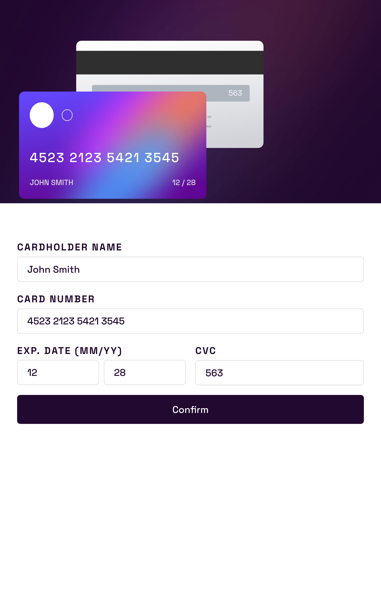
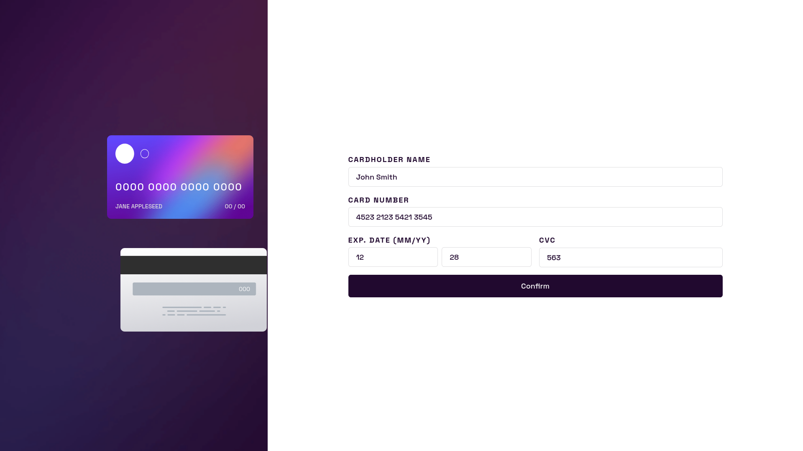

# Frontend Mentor - Interactive card details form solution

This is a solution to the [Interactive card details form challenge on Frontend Mentor](https://www.frontendmentor.io/challenges/interactive-card-details-form-XpS8cKZDWw). Frontend Mentor challenges help you improve your coding skills by building realistic projects.

## Table of contents

- [Overview](#overview)
  - [The challenge](#the-challenge)
  - [Screenshot](#screenshot)
  - [Links](#links)
- [My process](#my-process)
  - [Built with](#built-with)
  - [Useful resources](#useful-resources)
- [Author](#author)

**Note: Delete this note and update the table of contents based on what sections you keep.**

## Overview

### The challenge

Users should be able to:

- Fill in the form and see the card details update in real-time
- Receive error messages when the form is submitted if:
  - Any input field is empty
  - The card number, expiry date, or CVC fields are in the wrong format
- View the optimal layout depending on their device's screen size
- See hover, active, and focus states for interactive elements on the page

### Screenshot

### Links

- Solution URL: (https://github.com/DrZero1234/FEM_interactive_card)
- Live Site URL: (https://drzero1234.github.io/FEM_interactive_card)

## My process

### Built with

- Semantic HTML5 markup
- Typescript
- CSS custom properties
- Flexbox
- CSS Grid
- Mobile-first workflow

### Useful resources

- [Form styling](https://www.youtube.com/watch?v=nuDpLN2dazU) - This video is really useful for basic styling of forms
- [Form validation](https://developer.mozilla.org/en-US/docs/Learn_web_development/Extensions/Forms/Form_validation) - The official MDN documentation for the client side form validation basics.

## Author

- Frontend Mentor - [@DrZero1234](https://www.frontendmentor.io/profile/DrZero1234)
- Github - [@Drzero1234](https://github.com/DrZero1234)
